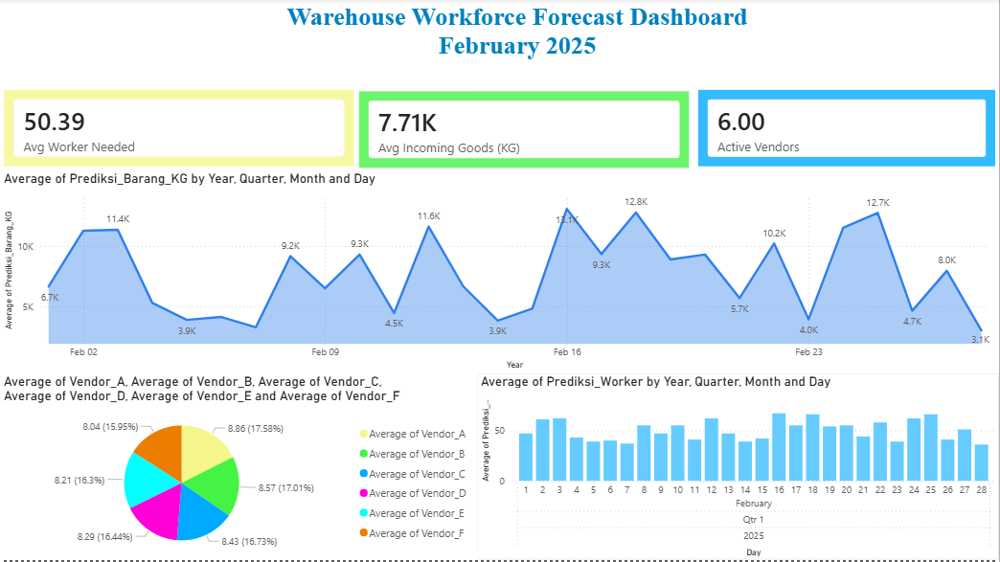

# Warehouse Workforce Forecast Dashboard

This project predicts outsourcing workforce demand based on incoming warehouse goods volume.

## Tools Used
- Excel
- Python (Google Colab)
- Machine Learning (Linear Regression)
- Power BI

## Project Workflow
Excel Dataset → Python Prediction → Power BI Dashboard

## Features
- Forecast workforce demand
- Predict incoming goods
- Automatic vendor allocation
- Interactive dashboard

## Files
- data/ : raw & prediction dataset
- notebook/ : Colab notebook
- dashboard/ : Power BI dashboard

## Dashboard Preview
(# Warehouse Workforce Forecast Dashboard

This project predicts outsourcing workforce demand based on incoming warehouse goods volume.

## Tools Used
- Excel
- Python (Google Colab)
- Machine Learning (Linear Regression)
- Power BI

## Project Workflow
Excel Dataset → Python Prediction → Power BI Dashboard

## Features
- Forecast workforce demand
- Predict incoming goods
- Automatic vendor allocation
- Interactive dashboard

## Files
- data/ : raw & prediction dataset
- notebook/ : Colab notebook
- dashboard/ : Power BI dashboard

## Dashboard Preview

